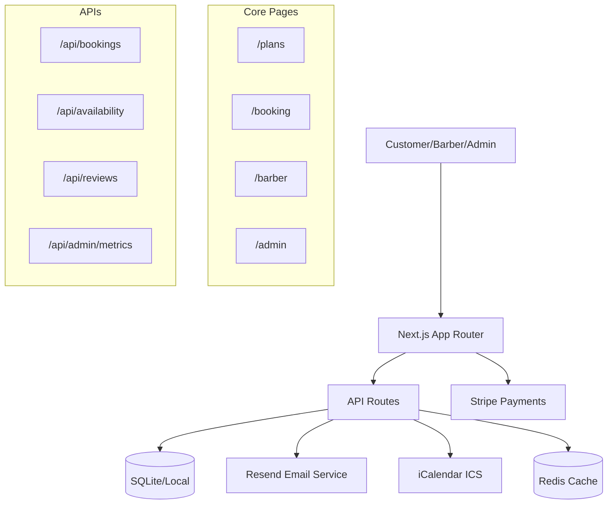

# Le Fade - Technical Overview

## Product Scope
Le Fade is a **haircut subscription service** targeting busy professionals with three core plans:
- **Free Trial**: One free cut at the shop for new customers
- **Standard**: 2 cuts/month at the shop ($39.99/month)  
- **Deluxe**: 2 cuts/month at customer's location ($60/month)

## MVP Definition
✅ **Core Features Implemented:**
- Real-time availability checking per barber/hour
- Duplicate booking prevention (DB constraints)
- Email confirmations with calendar invites (.ics)
- Three subscription plans with Stripe integration
- Barber dashboard for appointment management
- Admin metrics dashboard

## User Roles
- **CLIENT**: Books appointments, manages subscriptions
- **BARBER**: Views appointments, manages availability (Mike, Alex currently seeded)
- **OWNER**: Access to admin dashboard and metrics

## Main User Flows

### Booking Flow
```
Customer → /plans → /booking?plan=SELECTED → Availability Check → Book Appointment → Email Confirmation + ICS
```

### Barber Management
```
Barber → /barber → View Appointments → Confirm/Complete → Auto-refresh Dashboard
```

### Admin Operations
```
Admin → /admin → View KPIs → Manage Subscriptions → Analytics
```

## System Architecture



## Key Technical Capabilities

- **Real-time Availability**: 30-minute slots with conflict detection
- **Duplicate Prevention**: Unique constraints on (barberId, startAt) and (clientId, startAt)
- **Email Integration**: Professional HTML templates with calendar attachments
- **Graceful Degradation**: ICS downloads when email fails
- **Idempotent Requests**: Deterministic keys prevent double-bookings
- **Windows Development**: OneDrive-aware file locking compensation

## Current Status
**Functional MVP Beta** - Core booking flow operational with email notifications and calendar integration.

