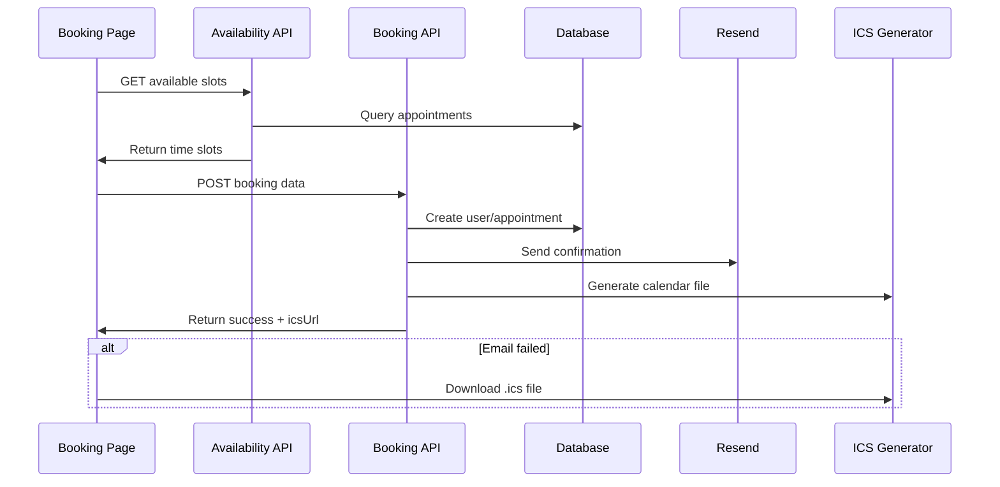

# Routes Inventory

## App Routes

### `/` (page.tsx)
- **Type**: Server Component
- **Dependencies**: Reviews API, Metrics API
- **Behavior**: Landing page with testimonials and KPIs
- **Loading**: Shows skeleton components
- **Error**: Graceful fallback to static content

### `/plans` (page.tsx)
- **Type**: Client Component
- **Dependencies**: Stripe price IDs, environment variables
- **Behavior**: Plan selection with CTA buttons + free trial link
- **Loading**: Skeleton card grid
- **Error**: Shows alert when Stripe not configured

### `/booking` (page.tsx)
- **Type**: Client Component
- **Dependencies**: Availability API, Booking API
- **Behavior**: Form submission with real-time availability
- **Loading**: Slot loading states, form submission blocking
- **Error**: 409 conflict messages, validation errors

### `/barber` (page.tsx)
- **Type**: Client Component
- **Dependencies**: Bookings API
- **Behavior**: Auto-refresh dashboard, manual refresh button
- **Loading**: Loading states for appointment lists
- **Error**: Graceful degradation to empty state

### `/admin` (page.tsx)
- **Type**: Server Component
- **Dependencies**: Metrics API, Bookings API
- **Behavior**: KPIs dashboard with real-time data
- **Loading**: Metric card skeletons
- **Error**: Zero-value metrics on failure

## API Routes

### `/api/bookings` (route.ts)
- **Methods**: POST, GET
- **Input Schema**:
  ```typescript
  z.object({
    customerName: z.string().min(2),
    customerEmail: z.string().email(),
    customerPhone: z.string().min(10),
    selectedDate: z.string(), // YYYY-MM-DD
    selectedTime: z.string(), // "10:00 AM"
    selectedBarber: z.string(),
    plan: z.enum(["standard", "deluxe", "trial"]),
    location: z.string().optional(),
    notes: z.string().optional()
  })
  ```
- **Response Shape**: `{ appointment, emailed, icsUrl, emailReason }`
- **Status Codes**: 201 (Created), 400 (Validation), 409 (Conflict), 500 (Server)
- **Side Effects**: Creates user/appointment, sends emails, ICS generation

### `/api/availability` (route.ts)
- **Methods**: GET
- **Query Params**: `barberName`, `date`, `plan`
- **Response Shape**: `{ barberId, barberName, date, availableSlots: [{time, available}] }`
- **Status Codes**: 200 (OK), 404 (Barber not found)
- **Side Effects**: Redis caching, conflict checking

### `/api/bookings/ics/[id]` (route.ts)
- **Methods**: GET
- **Response**: Raw ICS file (`text/calendar`)
- **Headers**: `Content-Disposition: attachment`
- **Side Effects**: None (read-only)

### `/api/admin/metrics` (route.ts)
- **Methods**: GET
- **Response Shape**: `{ totalAppointments, completedAppointments, revenue, chartData }`
- **Status Codes**: 200 (OK), 500 (Server)
- **Side Effects**: None (read-only metrics)

### `/api/reviews` (route.ts)
- **Methods**: GET
- **Response Shape**: `[{ id, name, rating, comment, createdAt }]`
- **Side Effects**: None (read-only)

## Booking Flow Call Graph



## Error Handling Patterns

### Common Error Responses
- **400**: Validation errors with Zod issue details
- **404**: Barber not found, appointment not found
- **409**: Conflicting bookings, duplicate trials
- **500**: Server errors with sanitized messages

### User-Facing Messages
- **Time Conflicts**: "That time was just taken. Please pick another."
- **Trial Used**: "You've already used your free test cut."
- **Validation**: Form field errors with inline correction

