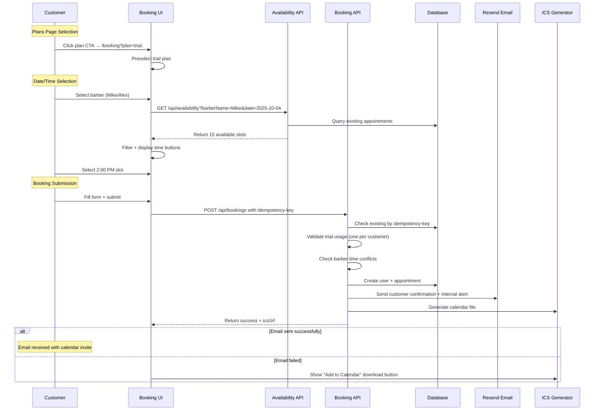
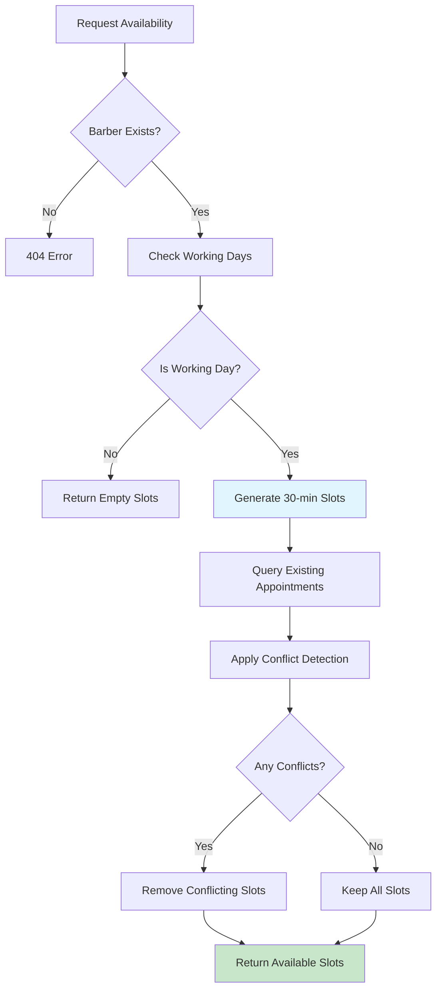
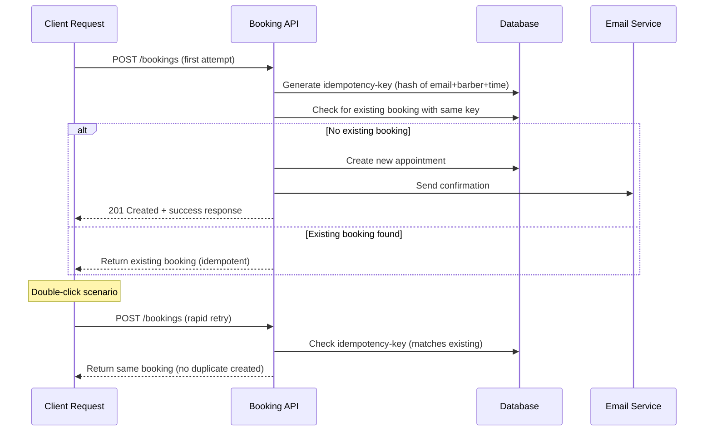
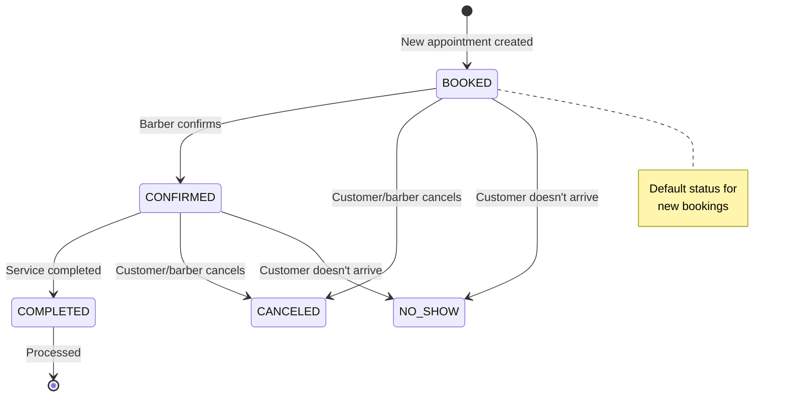

# Workflow Documentation

## Core Booking Flow

### Sequence Diagram: Complete Booking Process


## Availability Checking Flow

### Time Slot Generation Logic


### Working Hours Configuration
```typescript
// src/lib/hours.ts
const BARBER_HOURS = {
  Mike: {
    start: '09:00',
    end: '17:30',
    workingDays: ['Mon', 'Tue', 'Wed', 'Thu', 'Fri', 'Sat']
  },
  Alex: {
    start: '10:00',
    end: '16:30', 
    workingDays: ['Mon', 'Tue', 'Wed', 'Thu', 'Fri', 'Sat']
  }
}
```

## Deduplication & Unique Constraints

### Duplicate Prevention Strategy


### Database Constraints
1. **Barber Time Slot**: `@@unique([barberId, startAt])`
2. **Client Time Slot**: `@@unique([clientId, startAt])`
3. **Idempotency**: `@@unique([idempotencyKey])`

### Cleanup Process
```bash
# Remove duplicates before applying constraints
npm run db:dedupe

# Apply schema changes
npm run db:migrate
```

## Plans → Booking Integration

### URL-Based Plan Selection
```typescript
// src/app/booking/page.tsx
const searchParams = useSearchParams();
const initialPlan = searchParams.get('plan') || 'standard';

// Form preselects based on URL
defaultValues: {
  plan: initialPlan as "standard" | "deluxe" | "trial"
}
```

### Plan Flow Mapping
- `/plans` → Click "Free Trial" → `/booking?plan=trial`
- `/plans` → Click "Get Standard" → `/booking?plan=standard`  
- `/plans` → Click "Get Deluxe" → `/booking?plan=deluxe`

## Barber Dashboard Workflow

### Auto-Refresh Pattern
```typescript
// src/app/barber/page.tsx
useEffect(() => {
  fetchAppointments();
  
  // Auto-refresh every 60 seconds
  const interval = setInterval(() => {
    fetchAppointments();
  }, 60000);

  return () => clearInterval(interval);
}, []);
```

### Status Transition Flow


## Email Integration Workflow

### Email Service Initialization
```typescript
// src/lib/notify.ts
const resend = process.env.RESEND_API_KEY 
  ? new Resend(process.env.RESEND_API_KEY) 
  : null;

export async function sendBookingEmail(appointment) {
  if (!resend || !process.env.NOTIFY_FROM) {
    return { emailed: false, reason: 'no-resend' };
  }
  
  // Send customer + internal emails
  // Return success/failure status
}
```

### Email Fallback Chain
1. **Primary**: Resend API with HTML template + ICS attachment
2. **Fallback**: ICS download link + UI notification
3. **Graceful**: Check console logs show "email skipped" message

## Data Migration Workflows

### Development to Production
```bash
# 1. Backup existing data
npm run db:studio  # Export via Prisma Studio

# 2. Clean production database  
npm run db:dedupe  # Remove duplicates

# 3. Apply schema changes
npm run db:migrate # Push latest schema

# 4. Seed production data
npm run seed:reviews
```

### SQLite to PostgreSQL Migration
1. **Schema Export**: `prisma db push --preview-feature`
2. **Data Migration**: Export/import via Prisma migrations
3. **Environment Update**: Change `DATABASE_URL` to PostgreSQL
4. **Validation**: Run full test suite against new database

